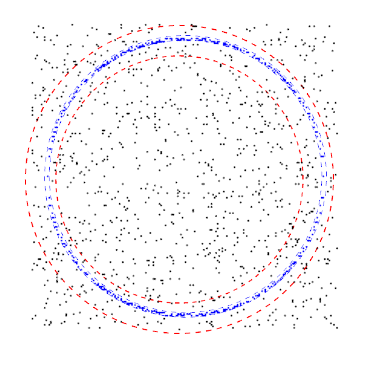

# Efficient Robust Digital Annulus Fitting with Bounded Error

**Author**: Minh-Son Phan

## Introduction

This project implements the fitting algorithm in the paper of Phan et al: 
["Efficient Robust Digital Annulus Fitting with Bounded Error"](http://link.springer.com/chapter/10.1007%2F978-3-642-37067-0_22).
The goal is to approximate the parameters of a digital annulus from a set of points. The algorithm allows to control the running time w.r.t the estimated error. 
It means that the faster the fitting is, the higher the estimated error is.
Please read the paper for more detail.

**Language**: C++ with OpenGL.

## File structure

    inc: header file
    src: source file
    result: fitting results
    
## How to compile

- open the project folder in terminal
- go to src directory
- type make in terminal to run Makefile

## How to test

In terminal, run: **./DigitalAnnulusFitting -f [filename] -e [epsilon] -w [width] -v [view]**

where:

- [filename] : for data file, otherwise : program randomizes data
- [epsilon] : default epsilon is "2.0", epsilon should be from 3.0 to 1.0
- [width] : default width is "3.0"
- [view] : display results with another views
    - view = 1 : view of digital annulus by using approximate method + plane adjusting
    - view = 2 : view of digital annulus by using only approximate method
    - view = 3 : view of digital plane by using approximate method + plane adjusting
    - view = 4 : view of digital plane by using only approximate method

## Example

**./DigitalAnnulusFitting -e 3.0**

> test with epsilon = 3.0, randomize data, width = 3.0

> display results with digital annulus view by using approximate method + plane adjusting

**./DigitalAnnulusFitting -f circle_data_400_100.txt -e 3.0**

> identical to above setting but import data from file

