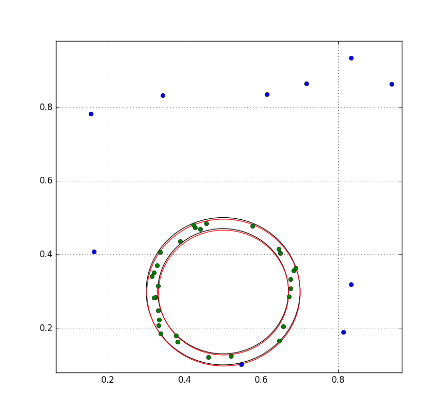

# Optimal 2D Digital Annulus Fitting

## Introduction

The project is an implement of the fitting algorithm from the paper of Rita Zrour et al: 
["Optimal Consensus Set for nD Fixed Width Annulus Fitting"](http://link.springer.com/chapter/10.1007%2F978-3-319-26145-4_8).
The goal is to estimate the optimal parameters of a digital annulus from a set of points.

## Remark

- The complexity is *N^(n+1)logN*, where *N* is the number of points (inliers+outliers)
  and *n* is the dimension of point.
- The code works well but the runtime need to be improved for large number of points.

## How to use test.py

Before running test.py, user need to specify some parameters:

- set the digital annulus parameters: center, radius, width
- set number of inliers and outliers
